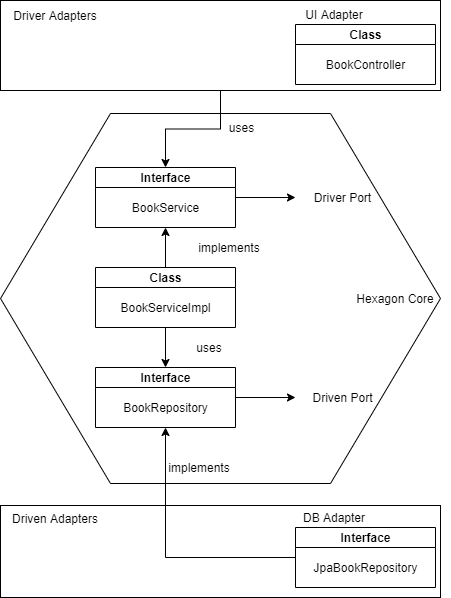

# CMEPPS Tarea Sesión 4

Inicie un proyecto y póngalo bajo control de versiones en Git. Crea un proyecto con arquitectura hexagonal con Spring.

  

  

  

---

**Hecho por Fernando García-Palomo Albarrán**
